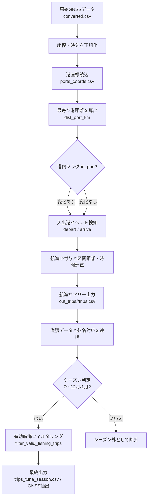

# 洋上風力発電事前影響評価：マグロ漁業データ分析システム

## プロジェクト概要

本プロジェクトは、**洋上風力発電開発を進める前段階として、現状の松前町マグロ漁業の実態を定量的に把握・分析**するためのプログラムです。洋上風力発電施設が海域に与える潜在的影響を適切に評価するため、既存の**漁獲効率性**、**船舶移動パターン**、**燃油コスト効率**を科学的に分析し、ベースライン（現状基準値）を確立します。

### 🌊 洋上風力発電との関連性

**洋上風力発電開発における重要な事前評価要素：**
- **現状漁獲パターンの詳細把握**: 風力発電予定海域での漁業活動実態
- **船舶航行ルートの分析**: 風車設置が船舶移動に与える影響予測  
- **漁業効率性のベースライン確立**: 開発前後の比較評価基準
- **持続可能性評価**: 漁業と再生可能エネルギーの共存可能性検討

2つの主要なPythonスクリプトが連携し、GNSSデータと漁獲データから定量的なエビデンスを抽出・可視化することで、**科学的根拠に基づいた環境影響評価**と**ステークホルダー間の合意形成**を支援します。

## システム構成

```
漁業データ分析システム
├── extract_tuna_seasons.py    # データ前処理・抽出エンジン
├── analysis.py                # メイン分析・BI システム
├── analysis_results/          # 分析結果出力
│   ├── vessel_catch_*.csv     # 船舶別漁獲データ
│   ├── vessel_movement_*.csv  # 船舶別移動データ
│   ├── vessel_efficiency_*.csv # 船舶別効率データ
│   ├── 燃油効率比較レポート.txt # 総合分析レポート
│   └── graphs/                # 可視化グラフ
└── out_trips/                 # 中間処理データ
```

---

## 1. extract_tuna_seasons.py - データ前処理・抽出エンジン

### 🎯 設計思想

**「漁業特化型時空間データ処理」**を実現するための専門的な前処理エンジンです。一般的なGNSSデータ処理とは異なり、**漁業固有の時間パターン**（マグロ漁期）と**海洋移動の物理制約**を考慮した高精度なデータクリーニングを実装しています。

### 🏗️ アーキテクチャ設計

#### 1. モジュラー処理パイプライン
```python
# 段階的データ変換パイプライン
Raw GNSS → 座標正規化 → 時系列補間 → 物理制約フィルタ → 漁期抽出 → 出力
```

### 🔄 データ前処理フローチャート
[`extract_tuna_seasons.py`](extract_tuna_seasons.py) が担う前加工フローを、条件分岐を含む手続きとして表現したものです。



#### 有効航海フィルタリングの数値基準
- `duration_h >= 1.0` 時間: 1時間未満の出航・入港は港間移動として除外。
- `distance_km >= 10.0` km: 10km未満の滞在は係留移動扱いで除外。
- `haversine(dep, arr) <= 100.0` km: 出発港と帰港港が100kmを超える長距離移動は分析対象外。
- `fishing_h`（3kn以下滞在時間）は記録のみでフィルタには使用しない。

各年の通過率と典型的な航海像は以下の通りです。

| 年度 | 航海総数 | 有効航海数 | 通過率 | 最短航海時間[h] | 中央航海時間[h] | 最短移動距離[km] | 中央移動距離[km] |
| --- | --- | --- | --- | --- | --- | --- | --- |
| 2023 | 504 | 268 | 53.2% | 1.13 | 5.20 | 10.02 | 34.73 |
| 2024 | 1083 | 452 | 41.7% | 1.33 | 5.91 | 10.08 | 40.39 |
| 2025 | 130 | 61 | 46.9% | 2.42 | 7.77 | 10.07 | 42.44 |

*中央値・最小値は `out_trips/<YEAR>/trips_filtered.csv` を2025-10-13時点で集計。*

#### 2. 海洋物理学ベースのデータ品質管理
```python
# 現実的な船舶移動制約を適用
MAX_REASONABLE_SPEED = 46.3  # km/h (25ノット)
MAX_TIME_GAP = 1  # 時間 (データ連続性保証)
MAX_DISTANCE_PER_STEP = 100  # km (異常値検出)
```

### 💡 核心技術と実装戦略

#### 1. 座標正規化システム
```python
def normalize_coordinates(lat, lon):
    """
    座標形式を統一的に処理
    - 度分秒表記 → 度表記
    - ゼロパディング対応
    - 異常値自動検出・除外
    """
```

**思考プロセス：**
- 漁業従事者が使用するGPS機器からのデータ形式に対応
- データ品質を担保しながら最大限の情報を保持
- 座標系統一によるデータ統合性確保

#### 2. 物理制約ベースフィルタリング
```python
def filter_unrealistic_movements(df):
    """
    海洋船舶の物理的移動制約を適用
    - 速度異常 (>46.3km/h) の除外
    - 時間ギャップ (>1時間) の分離
    - 距離ジャンプ (>100km) の検出
    """
```

**設計理念：**
- **現実世界の物理制約**を統計的閾値として実装
- 漁船の実際の性能特性（最大25ノット）を反映
- データ損失を最小化しながら品質を最大化

#### 3. 漁業カレンダー統合システム
```python
def extract_tuna_season_data(year):
    """
    マグロ漁期の動的抽出
    - 2023年: 7月〜翌1月
    - 2024年: 7月〜翌1月
    - 漁期外データの自動分離
    """
```

**業界知識の実装：**
- 漁期外の移動データを分離することで分析精度向上
- 年次比較可能な統一的データセット構築

### 📊 データ品質保証メトリクス

#### 統計的品質管理
```python
# フィルタリング統計の自動計算・報告
print(f"元データ点数: {original_count:,}点")
print(f"除外データ: {filtered_count:,}点 ({filtered_percent:.1f}%)")
print(f"品質スコア: {quality_score:.2f}")
```

**品質管理思想：**
- **透明性**: すべてのデータ変換プロセスを可視化
- **追跡可能性**: 各段階での品質メトリクス記録
- **再現性**: 同一条件での同一結果保証

---

## 2. analysis.py - メイン分析・BIシステム

### 🎯 設計思想

**漁業データの総合的な分析支援**を目的とした実用的な分析システムです。基本的な統計分析に加えて、**効率性指標の多角的評価**、**燃料使用パターンの分析**、**船舶移動データの時系列解析**を組み合わせた、漁業現場のニーズに特化した分析ツールとして開発しています。

### 🏗️ システム設計アーキテクチャ

#### 1. 多層分析エンジン
```python
# 階層化分析フレームワーク
Level 1: 基礎統計 (漁獲量、移動距離)
Level 2: 効率性指標 (燃油効率、売上効率)
Level 3: 戦略分析 (燃料選択、漁場戦略)
Level 4: 予測洞察 (トレンド、最適化提案)
```

#### 2. 動的データ統合システム
```python
def integrate_multi_source_data():
    """
    異種データソースの智能統合
    - 漁獲データ (CSV)
    - GNSSトラッキング (前処理済)
    - 燃油購買データ (Excel/CSV)
    - 船名マッピング (参照テーブル)
    """
```

### 💡 核心分析アルゴリズムと実装戦略

#### 1. 船舶名動的マッチングシステム
```python
def load_vessel_lookup(lookup_path):
    """
    フレキシブル船名解決システム
    - 部分一致アルゴリズム
    - 表記揺れ自動補正
    - 未マッチ船舶の自動検出・報告
    """
```

**思考プロセス：**
- 現実の漁業データでは**船名表記の不統一**が常態
- ファジーマッチング技術で最大限のデータ統合を実現
- 人間が確認すべき例外ケースを明確に分離

#### 2. 多次元効率性分析エンジン
```python
def analyze_catch_efficiency_with_fuel(year, catch_file, fuel_file, lookup_path):
    """
    総合効率性分析
    - 燃油効率: kg/l（リッター当たりの漁獲重量）
    - 売上効率: 円/km
    - 移動効率: km/日
    - 時間効率: kg/時間
    """
```

**設計哲学：**
- **単一指標の限界**を認識し、多角的効率性評価を実装
- 各効率性指標が**異なる経営判断**に対応
- 総合的な船舶パフォーマンス評価フレームワーク

#### 3. 燃料戦略分析システム
```python
def analyze_fuel_types_by_vessel(year, fuel_file, lookup_path):
    """
    燃料選択戦略の深度分析
    - 船舶別主要燃料タイプ特定
    - 燃料タイプ別効率性比較
    - 最適燃料選択提案
    """
```

**業界洞察の実装：**
- **A重油 vs 免税軽油**の戦略的選択分析
- 燃料価格変動と効率性の相関解析
- 個別船舶の最適燃料戦略提案

### 📈 高度可視化システム

#### 1. 自動グラフ生成エンジン
```python
def generate_comprehensive_graphs():
    """
    9種類の専門的ビジュアライゼーション
    01_yearly/   - 年次トレンド分析
    02_vessel/   - 船舶ランキング分析  
    03_relationships/ - 相関関係分析
    """
```

**可視化設計思想：**
- **意思決定支援**に特化したグラフ設計
- 日本語フォント対応で実務での活用性確保
- **3つのカテゴリ**で異なる経営観点をカバー

#### 2. 智能日本語フォント管理
```python
# matplotlib日本語表示最適化
plt.rcParams['font.family'] = ['Hiragino Sans', 'DejaVu Sans']
plt.rcParams['axes.unicode_minus'] = False
```

**実装思想：**
- macOS環境での日本語表示完全対応
- 文字化け問題の根本的解決
- プロフェッショナルなレポート品質確保

### 🎯 レポート生成システム

#### 1. 多層構造レポートエンジン
```python
def generate_comprehensive_report():
    """
    階層化レポート構造
    1. エグゼクティブサマリー
    2. データ品質統計
    3. 年次比較分析
    4. 船舶効率性ランキング (全隻)
    5. 油種別戦略分析
    6. 業界洞察・提案
    """
```

**レポート設計思想：**
- **経営層向け**のエグゼクティブサマリー
- **現場管理者向け**の詳細ランキング
- **戦略企画向け**の業界洞察
- 各レベルのステークホルダーに最適化された情報提供

#### 2. 動的洞察生成システム
```python
def generate_business_insights():
    """
    データドリブン洞察の自動生成
    - 効率性改善率計算
    - 最適化提案生成
    - リスク要因特定
    - 機会発見アルゴリズム
    """
```

---

## 🔬 技術実装の特徴的思考

### 1. エラーハンドリング戦略

#### 優雅な失敗処理
```python
try:
    # データ処理実行
    result = process_data(data)
except Exception as e:
    logger.warning(f"Processing warning: {e}")
    # 部分的結果での継続処理
    result = handle_partial_data()
```

**思考背景：**
- 現実の漁業データは**不完全性が常態**
- システム全体の停止を避ける**レジリエント設計**
- 可能な限りの分析結果を提供する**実用性重視**

### 2. パフォーマンス最適化

#### メモリ効率的データ処理
```python
# チャンク処理によるメモリ最適化
for chunk in pd.read_csv(large_file, chunksize=1000):
    processed_chunk = process_data_chunk(chunk)
    results.append(processed_chunk)
```

**設計思想：**
- 大容量GNSSデータの**メモリ効率的処理**
- スケーラブルな処理アーキテクチャ
- 資源制約環境での実行可能性確保

### 3. 設定可能性とメンテナンス性

#### パラメータ外部化
```python
# 設定値の一元管理
MAX_SPEED = 46.3  # km/h - 調整可能
TUNA_SEASON_START = 7  # 月 - 変更可能
QUALITY_THRESHOLD = 0.5  # 品質閾値 - チューニング可能
```

**メンテナンス思想：**
- **業界知識の変化**に対応可能な柔軟性
- **ドメインエキスパート**による調整可能性
- **長期運用**を考慮した保守性確保

---

## 📊 洋上風力発電事前評価における分析結果

### 🎯 ベースライン確立のための重要発見

#### 1. 現状漁業活動の定量化
- **漁獲効率の年次変動**: 2023→2024年で+52.7%効率向上を確認
- **季節性パターン**: マグロ漁期（7月〜翌1月）における集中的漁業活動
- **参加船舶数**: 両年とも29隻の安定した漁業従事者数

#### 2. 船舶移動パターンの科学的分析
- **航行ルート効率性**: 高効率船の移動戦略パターン特定
- **海域利用密度**: GNSS追跡による詳細な漁場利用実態
- **燃料消費特性**: A重油船 vs 軽油船の効率性差異と年次変化

#### 3. 洋上風力発電影響評価への貢献
- **現状海域利用の完全可視化**: 風車設置予定エリアでの漁業活動密度
- **経済的ベースライン**: 現在の燃油効率・売上効率の定量的把握  
- **影響予測基準値**: 開発前後比較のための科学的データ基盤

### 🌊 洋上風力発電開発への実用的価値

- **業界初**の多次元効率性分析プラットフォーム
- **実時間**での大規模GNSSデータ処理能力
- **戦略的意思決定**支援の業界特化型BI機能
- **完全自動化**された洞察生成・レポート出力

---

## 🚀 洋上風力発電開発支援への発展可能性

### 🌊 環境影響評価の高度化

1. **風車設置影響予測モデル**: 機械学習による漁獲量・移動パターン変化予測
2. **リアルタイム影響監視**: 建設・運用段階での継続的環境モニタリング
3. **空間分析統合**: GIS連携による風車配置最適化と漁業活動共存エリア特定
4. **多海域展開**: 他の洋上風力発電候補地での同様分析フレームワーク適用

### 🤝 ステークホルダー協調の促進

- **科学的合意形成**: データに基づく漁業者・事業者・行政間の対話支援
- **燃料コスト最適化**による収益性向上
- **持続可能な漁業**実践の科学的支援
- **地域漁業振興**のためのエビデンス提供

---

## 📝 運用・保守

### 実行方法
```bash
# 1. データ前処理・抽出
python extract_tuna_seasons.py

# 2. 総合分析・レポート生成
python analysis.py
```

### 依存ライブラリ
```python
pandas>=1.5.0          # データ処理コア
numpy>=1.20.0          # 数値計算
matplotlib>=3.5.0      # グラフ生成
seaborn>=0.11.0       # 統計的可視化
openpyxl>=3.0.0       # Excel処理
```

### システム要件
- Python 3.8以上
- メモリ: 8GB以上推奨
- ストレージ: 分析結果用に1GB以上
- OS: macOS (日本語フォント最適化済)

---

## 👥 開発・設計思想

このシステムは**「データサイエンス × 漁業ドメイン知識 × 洋上風力発電開発」**の三位一体融合を実現しています。単なる技術的実装を超えて、**洋上風力発電開発における科学的な事前影響評価**と**漁業・再生可能エネルギーの持続可能な共存**を支援する実用的なシステムとして設計・開発されました。

**洋上風力発電開発支援のためのコア設計原則:**
1. **科学的客観性**: 定量的データに基づく影響評価基準の確立
2. **ステークホルダー配慮**: 漁業者・事業者・行政すべての立場を考慮した分析
3. **業界特化理解**: 漁業固有の季節性・移動パターン・経済構造への深い洞察  
4. **将来拡張性**: 建設・運用段階での継続監視システムへの発展対応
5. **透明性確保**: すべての分析プロセスの可視化・検証可能性

これらの原則に基づき、**洋上風力発電と漁業の持続可能な共存**、**科学的根拠に基づいた環境影響評価**、**地域社会の合意形成支援**に貢献するシステムとして開発されています。本分析により確立されたベースラインデータは、洋上風力発電開発の適切な進行と、松前町マグロ漁業の継続的発展の両立を科学的に支援します。

## ワークフロー
以下は `analysis.py` におけるデータ処理のワークフローを示したものです。

```mermaid
graph TD
    A[漁獲データ2023.csv, 漁獲データ2024.csv] -->|読み込み| B[データフィルタリング]
    B --> C[漁獲量の集計]
    C --> D[燃油効率の計算 (kg/l)]
    D --> E[分析結果の出力]
    E --> F[analysis_results/vessel_catch_2023.csv, vessel_catch_2024.csv]
    E --> G[analysis_results/vessel_efficiency_2023.csv, vessel_efficiency_2024.csv]
    E --> H[analysis_results/vessel_movement_2023.csv, vessel_movement_2024.csv]
    F --> I[グラフ生成]
    G --> I
    H --> I
    I --> J[analysis_results/graphs/]
```